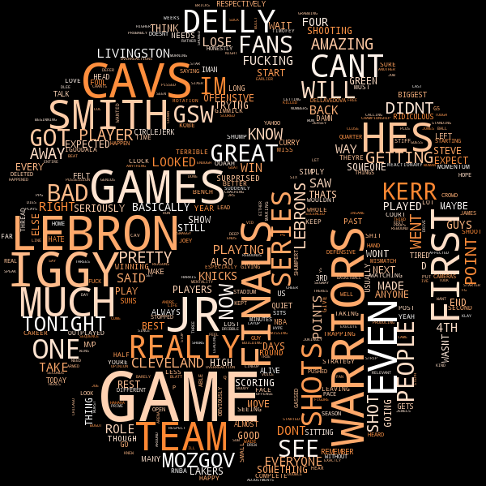

jebe
==========

A little word cloud generator for the Reddit NBA Finals Post Game threads.

## Installation

Install the requirements: 

`sudo pip install -r requirements.txt`

## Generate the clouds

Run the thread web scrapper:

`python scrape_reddit_threads.py`

This should generate text files in the text_files folder.

Run the word cloud builder:

`python build_world_clouds.py`

This should generate images in the images folder.

Note: 

You should be able to generate your own word clouds if your replace the list of r/nba threads in [scrape_reddit_threads.py](scrape_reddit_threads.py) with ever reddit threads of your chosing assuming reddit.com does not change the layout of their images in the future.

## Examples

Example 1:

Example 2:

  

This project was named after one of Genghis Khan's generals, [Jebe](https://en.wikipedia.org/wiki/Jebe) 
